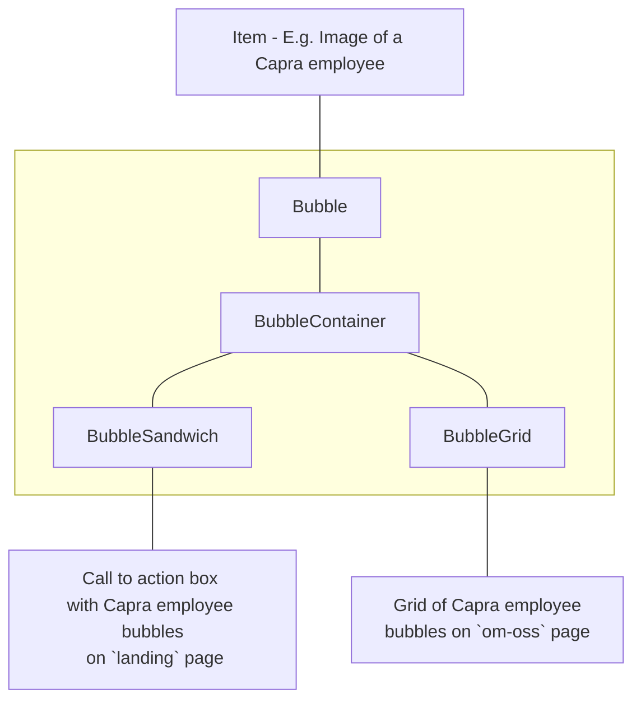

# Bubbles

## Components



### `Bubble`

Responsible for

- `absolute` positioning
- styling
- rendering the bubble `item`

### `BubbleContainer`

Responsible for

- `relative` container for the bubbles `absolute` positioning
- Assigning positions to `Bubble`'s
- Shuffle or shifting positions after a bubble is clicked

### `BubbleSandwich`

Responsible for

- Rendering `children` with supplied `items` as bubbles on left and right side using `BubbleContainer`

### `BubbleGrid`

Responsible for

- Creating a dynamic set of grid positions for the bubble `items`
- Rendering the bubble grid using `BubbleContainer`

## Usage

Prepare a list of React Elements and pass them as `items`.

Use the prebuild `BubbleSandwich` or `BubbleGrid`.

Or generate your own `positions` and pass them and the `items` to `BubbleContainer`

```jsx
<BubbleGrid
  items={imageUrls.map((x) => (
    
  ))}
/>
```

See [`bubble.stories.tsx`](bubble.stories.tsx) for more examples
